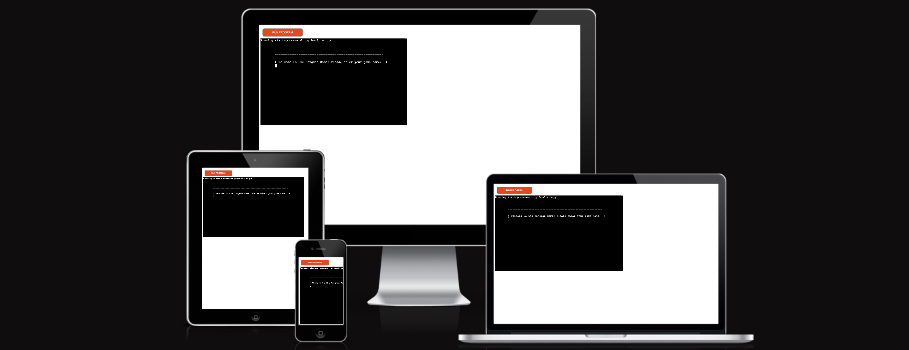
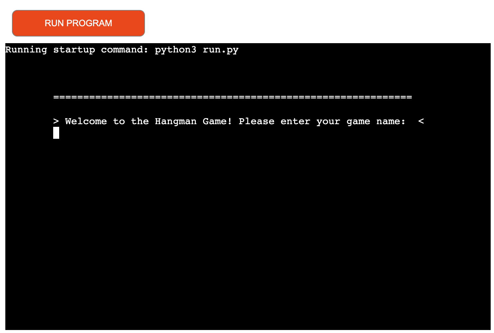
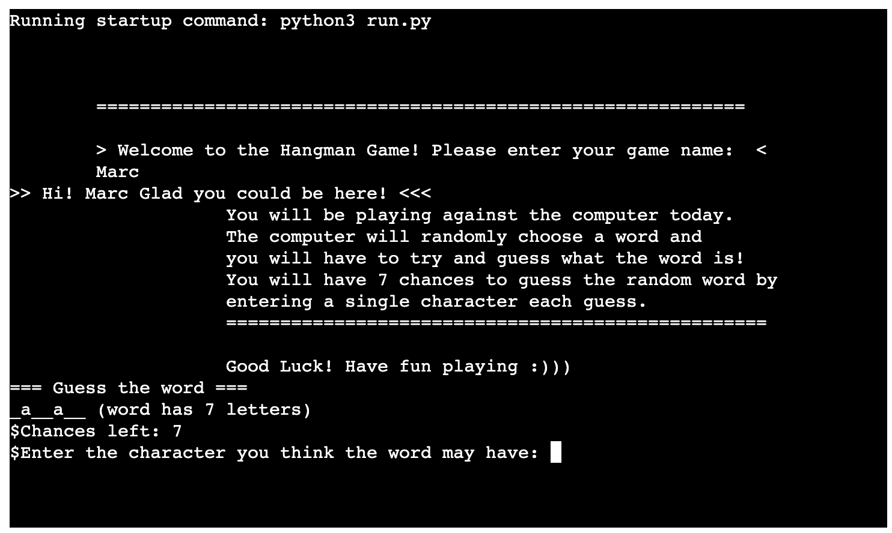
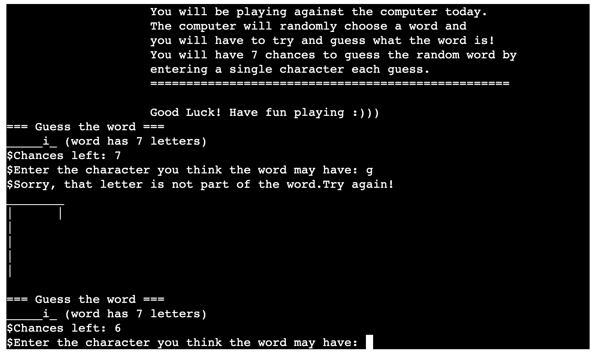
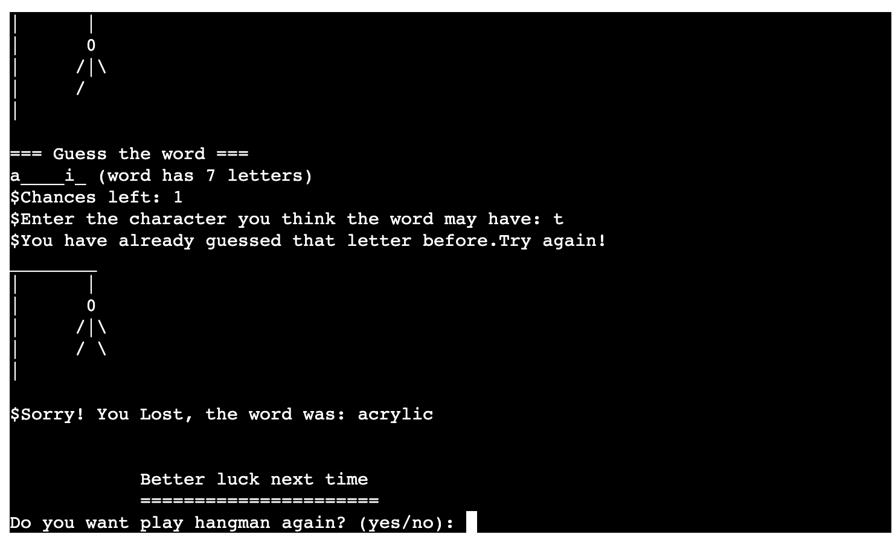
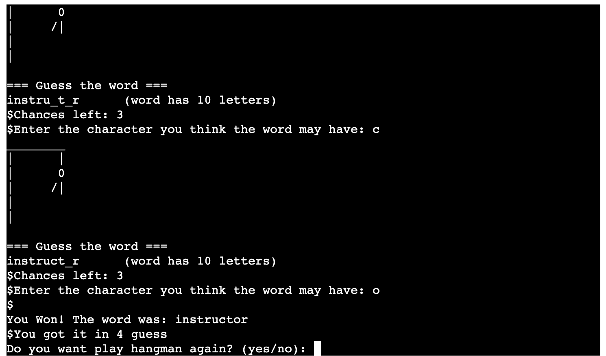
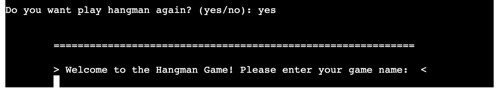
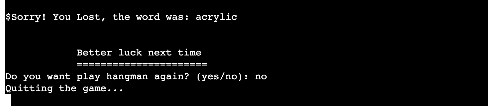
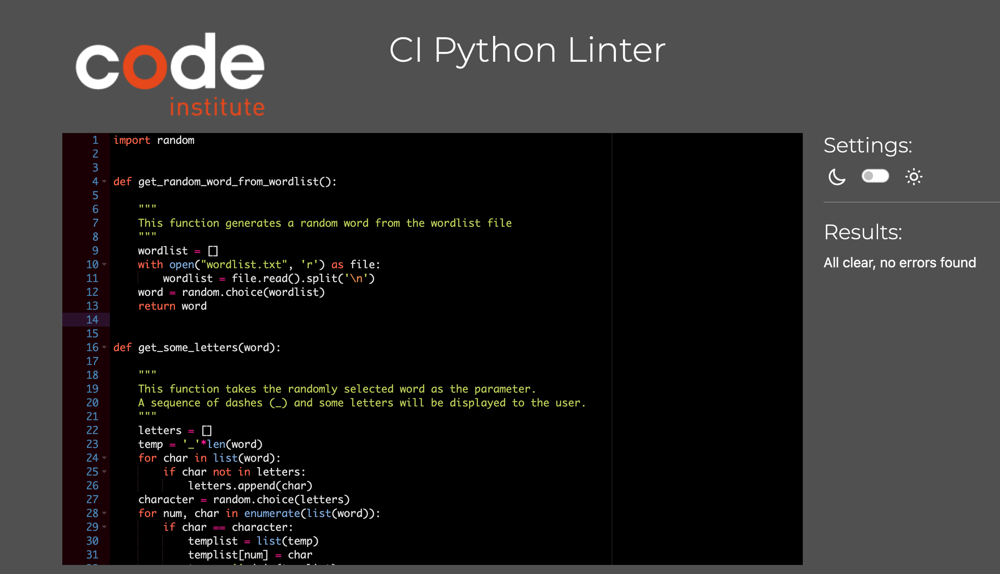

# Hangman Game
(Developed by: Marc Hopkins)

[Live webpage](https://hangman-game-tuti.onrender.com/)

## Introduction 

The Hangman Game is a word guessing game in which a user plays against the computer program to try and guess a random word within a certain amount of guesses.

## How to play 

Hangman is a guessing game for two or more players. One player thinks of a word, phrase, or sentence and the other(s) tries to guess it by suggesting letters or numbers within a certain number of guesses. 

In this version a user is prompted to enter their game name, once they have done this a short instruction list will display before then being asked to input a guess. The random word will be displayed as some letters and dashes (w_r_) if the user guesses correct a dash will be replaced with a letter and if a wrong letter is chosen more parts of the hangman image will display. A user will win if they get the word within the set amount of guesses and they lose if they run out of guesses and the whole hangman image is displayed on screen.

## Project Goals 

### User Goals
- The site's user wants to play an online hangman game in which they are tested and have fun in the proccess.

### Site Owner Goals
- The Site owner's goal is to provide a fun version of a family classic game which a user can enjoy with friends and family.

## User Experience 

### Strategy

#### Target Audience
- Users with an interest in guessing games
- Users looking for entertaing online content.

#### User Requirements and Expectations
- Simple navigation around game
- Immediate feedback on progress throughout game
- Accessibility

#### User Stories

##### Game Users
As a game user, I want to ...
1. ... easily navigate through the game.
2. ... get clear feedback whilst playing.
3. ... easily return to the beginning of the game and play again.

##### Game owner
As the game owner, I want to ...
1. ... interact with the game, stay engaged and be challenged.

### Scope 

#### Initial Stage

At the initial stage the game will present a welcome message and invite a user to enter their name, then display short instructions before a guess can be made by the user. If a user guesses the word with a set amount of guesses they are informed they won and if not they are told that they lose. At the end of a game the user can choose to play again or not.

#### Future Additions 

In the future it would enhance the experience of the game if the user had a choice of level that they could pick. Each level would include different lengths of words designed to test the user based on their ability and provide more of a challenge.

### Game Features

#### Welcome to the game 

Screenshot of Welcome to game section

- Features a welcome message and invites a user to input a game name.

#### Instructions 

Screenshot of instructions

- When a name is inputted then the instructions show and wish the user good luck. Further down the screen a user can input their guess.

#### User name saved 

Screenshot of saved user name

 
- The users name is saved when they input it. This makes the game more personal for users.

#### Wrong letter input

Screenshot of wrong letter feedback

- The user recieves instant feedback when a character that isnt in the random word is inputted.
- This happens in the form of a textual message and the hangman image parts appearing.

#### Lost Game

Screenshot of a lost game

- The user is told they lose the game and the full hangman is presented on screen.
- The option to play again is available to the user.

#### Won Game

Screenshot of a Winning game

- The user is told they won the game and that isstantly ends the game loop.
- The option to play again is again presnted to the user.

#### Restart Game

Screenshot of a restarted game

- If a user chooses the yes option they are taken back to the very start of the game so they can play again.

#### Quit Game

Screenshot of a quit game

- If the user chooses the no option they quit the game and a message is presented on screen to tell the user.

## Technologies Used

### Languages
- Python

### Tools 
- Git
- Github
- Render

### Helpful sites

A few sites came in handy when developing my own version of this game:

- <a href="https://www.w3schools.com/">W3 Schools</a>
- <a href="https://gist.github.com/">GitHub Gist<a>

## Testing and Validation

### PEP8 CI Python Linter

- No errors are flagged when testing the python code from run.py in the PEP8 CI Python Linter.

### Manual Testing

I have manually tested this project by doing the following:
- Entering numbers as input when the program is expecting letters.
- Entering more than one letter as a users guess.

Both of the above tests return the developers desired result.
- The game has been tested in the local terminal as well as the Render terminal.

#### Outstanding Issues 

There are currently no outstnading issues at this time to the developers knowledge.

### Testing User Stories

** As a game user, I want to ...**
1. ... Be able to enter a game name.
| **Feature** | **Action** | **Expected result** | **Actual Result** |
|-------------|------------|---------------------|-------------------|
| Pre game page | Enter game name | Game name is saved and the game loads | Works as expected |

2. ... Read how to play the game. 
| **Feature** | **Action** | **Expected result** | **Actual Result** |
|-------------|------------|---------------------|-------------------|
| Game terminal | Press enter after entering game name | user is welcomed to game and instructions on how to play are shown | Works as expected |

3. ... Easily submit a guess in the game.
| **Feature** | **Action** | **Expected result** | **Actual Result** |
|-------------|------------|---------------------|-------------------|
| Game Terminal | Enter guess after 'Enter the character you think the word may have' and press enter | guess is submitted and the program tells a user if the guess is in the word or not | Works as expected |

4. ... See progress throughout game.
| **Feature** | **Action** | **Expected result** | **Actual Result** |
|-------------|------------|---------------------|-------------------|
| Game terminal | A user enters a guess | After each guess a user takes it will either be part of the random word to guess or it will not and the hangman image will display more parts each time a wrong guess is submitted | Works as expected | 

5. ... Be able to play again. 
| **Feature** | **Action** | **Expected result** | **Actual Result** |
|-------------|------------|---------------------|-------------------|
| Game Terminal | Press 'yes' to 'Do you want to play again' | User is taken back to the very start of the game and can play again | Works as expected | 

6. ... Be able to quit the game.
| **Feature** | **Action** | **Expected result** | **Actual Result** |
|-------------|------------|---------------------|-------------------|
| Game terminal | Press 'no' to 'Do you want to play again' | The game is quit in the terminal and a message is presented to the user to tell them | Works as expected |

